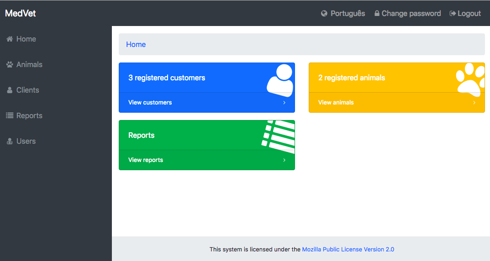

# Django MedVet

[](https://travis-ci.org/carlosribas/medvet)
[](https://codecov.io/gh/carlosribas/medvet)

The Django MedVet is an open veterinary system. Features ready to use:

- Patient and customer record;
- Consultation management (including exams and vaccines);
- Payment registration;
- Reports (vaccine booster list and services not paid).



## Installation - local development

1 - Clone Git repository:

  ```
  git clone https://github.com/carlosribas/medvet.git
  ```

2 - Run the app using [Docker](https://www.docker.com):

  ```
  cd medvet
  docker-compose up -d --build
  docker-compose run web python manage.py migrate
  docker-compose run web python manage.py createsuperuser
  ```

3- Optionally load some example data in Portuguese (you can edit it later by accessing localhost:8000/admin)
  ```
  docker-compose run web python manage.py loaddata load_initial_data.json
  ```

4 - Open your browser and type ```localhost:8000```

**Docker Cheat Sheet**

```
# stop the service
docker-compose stop

# connect to a running container
docker ps
docker exec -it <container_id> bash
```
